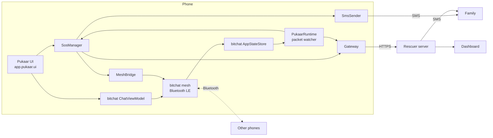

# Pukaar architecture

How the Android app is put together. For message formats see [protocol.md](protocol.md); for screens see [screens.md](screens.md).

## The big picture

- **bitchat** provides the Bluetooth mesh, the foreground service that keeps it alive, the public timeline and chat logic. Pukaar keeps bitchat's packages and namespace so upstream fixes can still be pulled.
- **Pukaar** (`app.pukaar`) adds the UI, the SOS engine, SMS, the server gateway and the system surfaces. It talks to bitchat in only a few places (below).

## Packages

| Package | What's in it |
|---|---|
| `app.pukaar` | `PukaarRuntime` (starts everything at app start), `PukaarIntents`, `PUKAAR_VERSION` |
| `app.pukaar.data` | `PukaarStore` (profile, contacts, settings, checklists in SharedPreferences), `Places` (bundled places JSON), models |
| `app.pukaar.device` | `DeviceStatus` (internet, signal, Bluetooth, battery, combined connection state), `Locations` (GPS) |
| `app.pukaar.sos` | `Packets` (wire format), `SosManager` (SOS lifecycle), `SmsSender`, `SosNotifier`, `ServerCrypto` (signatures, sealing), `MeshBridge` |
| `app.pukaar.gateway` | `Gateway`: uploads to the rescuer server and brings signed replies back into the mesh |
| `app.pukaar.system` | Lock-screen `SosActivity`, Quick Settings tile, widgets, `ShakeTrigger`, persistent `MeshNotification` |
| `app.pukaar.ui` | `PukaarNavHost`, theme, components, and one folder per screen group under `screens/` |

## Where Pukaar touches bitchat

| bitchat file | Change | Why |
|---|---|---|
| `BitchatApplication` | Calls `PukaarRuntime.init` | SOS engine, shake and gateway run whenever the process runs |
| `MainActivity` | Pukaar theme; Pukaar onboarding before bitchat's checks; Pukaar versions of the check screens; `PukaarNavHost` instead of `ChatScreen`; remembers a skipped battery prompt | Pukaar's UI is the app |
| `MeshForegroundService` | Notification built by `MeshNotification` | Pukaar copy, icon and an SOS action |
| `mesh/PowerManager` | `setPukaarBatterySaver` override | Settings > Battery saver controls scanning |
| `AndroidManifest.xml`, `build.gradle.kts`, `proguard-rules.pro` | Permissions, components, build settings, keep rules | Platform plumbing |

Reading from bitchat: `AppStateStore.publicMessages`, `peers` and `directPeers` (process-wide flows), and `ChatViewModel` for the chat screen. Writing to bitchat: `MeshBridge` (public broadcast) and `ChatViewModel.sendMessage`.

## SOS lifecycle

1. The countdown (`SosCountdownRoute`) collects people, flags and a message, and gets a location fix.
2. `SosManager.start` creates an `ActiveSos`, persists it, and shows the ongoing notification.
3. It broadcasts the SOS packet and the Contacts packet. If there's signal it texts contacts; if there's internet it uploads directly.
4. A 15-second keep-alive resends on a backoff, retries SMS, and retries the upload. New nearby phones trigger an immediate resend.
5. Signed Ack packets (or the direct upload's response) move it to Help notified, Rescuer attending and Resolved.
6. "I'm safe now" broadcasts a Safe packet, uploads it, texts family if possible, and closes the SOS.

The engine runs in the app process, which bitchat's foreground service keeps alive, so it continues with the screen off or the app closed.

## Data on the phone

| What | Where |
|---|---|
| Profile, contacts, settings, checklists, onboarding state | `SharedPreferences` "pukaar" via `PukaarStore` |
| Active SOS and own SOS ids | `SharedPreferences` "pukaar_sos" via `SosManager` |
| Places | `assets/pukaar/places.json` (sample data for now) |
| Guide text and checklists | String resources (`values/`, `values-hi/`) |
| Chat history | bitchat's own storage |

## Testing

- `app/src/test/java/app/pukaar/`: packet codec, size limit, signatures and sealing (with vectors from the Node reference in `docs/server-reference/`).
- UI: every screen has dark and light `@Preview`s.
- Bluetooth, SMS, shake and the lock-screen flows need real phones.
