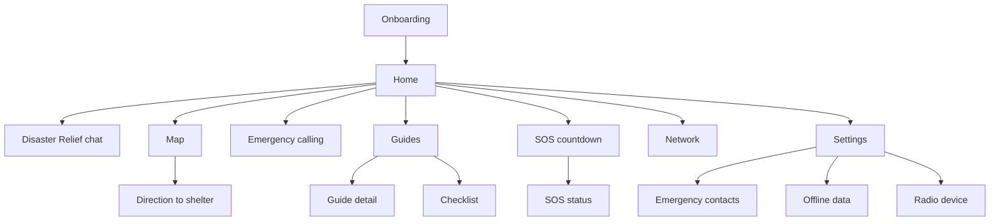
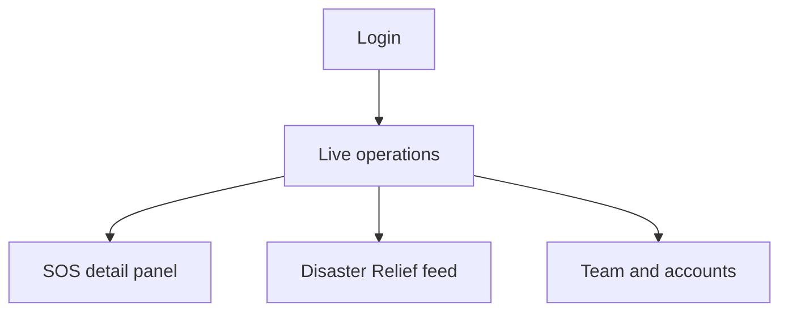

# Screens

Every screen in the Pukaar app and the rescuer dashboard, with what it contains, its states and the requirement it serves. Read the [design brief](design-brief.md) first.

## App navigation

Main navigation is a bottom bar with four tabs: **Home, Chat, Map, Guides**. Calling and SOS are reachable from Home and from a persistent SOS control. Settings and Network open from the Home header.

A connection status pill sits at the top of every main screen.

---

## 1. Onboarding

A short, skippable-where-possible flow, done once while the user ideally has internet.

| Step | Contents |
|---|---|
| 1.1 Language | Large buttons: हिन्दी, English, and "More languages coming". No other text first. |
| 1.2 Welcome | One illustration and two lines explaining what Pukaar does. "Continue". |
| 1.3 How it works | Three short cards: messages hop phone to phone; any phone with internet passes them on; rescuers see them on a map. Note that Disaster Relief messages are visible to rescuers (NFR-9). |
| 1.4 Permissions | One card per permission with why it's needed: Bluetooth and nearby devices, location, notifications, SMS, phone. "Allow" per item. Show what breaks if denied. |
| 1.5 Your details | Name, phone number. Optional: blood group, medical notes. |
| 1.6 Emergency contacts | Pick from phone contacts or add manually. Up to 5. Can skip and add later. |
| 1.7 Offline area | Detects the user's region and offers to download its map, shelters and routes, showing size in MB. Can skip. |
| 1.8 SOS setup | Explains the three triggers and offers to add the Quick Settings tile and widget. Includes a "Practice SOS" that runs the countdown without sending. |

States: no internet during onboarding (skip downloads, mark as pending), permission denied (show impact and a retry).

## 2. Home

The calm "command centre". Must work at a glance.

Contents, top to bottom:

- Connection status pill (see design brief states). Tapping opens Network.
- Large SOS button with ripple rings. Tap opens SOS countdown (NFR-1).
- If an SOS is active: a status card replacing the idle state, showing current delivery state and "I'm safe" button.
- Four large action tiles: Disaster Relief chat (with unread count), Map, Call for help, Guides.
- Small cards: battery level with power-saving tip when low; offline data missing warning; last message received.
- Header: app name, Settings icon.

States: first launch, SOS active, isolated, low battery (below 20%), offline data not downloaded.

## 3. SOS countdown

Opens from the Home button, the tile, the widget or shake.

- Full-screen, SOS red background.
- Huge countdown number from 5 to 0, with ripple animation.
- Huge "Cancel" button, easy to hit with a thumb.
- Quick details the user can tap during the countdown without stopping it: people count (stepper, default 1), flags as chips (Injured, Trapped, Need water, Need medicine, Child or elderly).
- Optional "Add message" which pauses the countdown and opens a short text field with a byte-based limit.
- After 0: transitions to SOS status.

States: opened from lock screen (minimal UI, no personal data shown beyond what's needed), no GPS fix yet (shows "Getting location…" and sends last known location if needed).

## 4. SOS status

Shows that the SOS is alive and what is happening to it. This screen should reassure.

- Large current state with icon and words: Sending, Relayed, Sent by radio, Help notified, Rescuer attending, Resolved.
- A timeline of states with times.
- A "path" visual: how the SOS travelled (for example: your phone, 2 phones, gateway, server) or "by radio".
- Your location as sent, with its accuracy.
- What was sent: people, flags, message. "Update details" sends an updated SOS.
- Contacts notified: list with status (sent directly, sent by server, pending).
- "I'm safe now" button, which sends a safe update after a confirmation.
- Tips while waiting: conserve battery, stay visible, from the guides.

States: still searching for any path, delivered, attending, resolved, cancelled.

## 5. Disaster Relief chat

A single group chat everyone shares.

- Header: "Disaster Relief", number of phones reachable, info icon explaining the chat is visible to rescuers.
- Message list: bubbles with sender name, time, optional location chip, and delivery state for own messages in words or a clear icon with label on tap.
- Messages from rescuers (sent from the dashboard) styled distinctly as official, for example with a badge.
- SOS messages appear in the feed as a distinct red card.
- Composer: text field with byte counter when close to radio limit, location attach button, quick reply chips ("Safe", "Need help", "Have water to share"), send button. When isolated, the send button offers "Send by radio" if a node is paired.

States: empty (first use), no peers, sending by radio, message failed and waiting, Hindi and English mixed.

## 6. Network

Explains the connection in more detail.

- Large ring visual showing nearby phones count.
- List: Internet (on or off), Bluetooth mesh (peers count), Radio node (paired or not, signal), Gateway mode (helping N people).
- Messages waiting to be delivered, with count.
- Button: "Pair a radio device".

## 7. Map

Offline map with a custom Pukaar style.

- Map with user location and accuracy circle.
- Layer toggles as chips: Shelters, Hospitals, Police.
- Bottom sheet: nearest shelter card with name, distance and "Show direction".
- Tapping a place opens a place card: name, type, distance, phone number if known, "Show direction".
- Search for places in the downloaded data.

States: map not downloaded (prompt with size, or a blank map with places list only), no GPS fix, outside the downloaded area.

## 8. Direction to shelter

A compass screen, not a calculated route. It points the way and counts down the distance.

- Destination card at top: shelter name, type, straight-line distance.
- Large compass arrow in the centre pointing toward the shelter, turning as the user turns.
- Large distance number that updates as the user walks ("850 m").
- A note that the arrow shows the straight-line direction, so the user should follow safe roads and avoid water, debris and damaged buildings.
- Small map preview showing the user and the shelter.
- Screen stays on with dimmed brightness while open.

States: compass needs calibration (show the figure-eight motion), no GPS fix, arrived (within about 50 m), shelter far away (over 5 km, suggest a closer one).

## 9. Emergency calling

- Signal status at top. If no signal: a clear note that calls may not connect, with a button to send an SOS instead (FR-18).
- Grid of large cards: 112 Emergency, Police 100, Ambulance 108, Fire 101, Women's helpline 1091, District control room (configurable number).
- Each card: icon, name, number, one tap to call (opens dialler).
- Emergency contacts section with call buttons.

## 10. Guides

- Disaster type cards: Flood, Earthquake, Fire, plus "Go-bag" and "Home safety" checklists.
- Each card shows checklist progress if relevant.

### 10a. Guide detail

- Tabs: Before, During, After.
- Short numbered steps with simple illustrations.
- Source line at the bottom (for example NDMA).
- Large text option.

### 10b. Checklist

- Tickable items grouped by category, progress bar, "Reset".

## 11. Emergency contacts

- List with name, phone, relationship, and a test status.
- Add from phone contacts or manually. Up to 5.
- "Preview SOS message" shows exactly what contacts will receive.

## 12. Settings

- Language.
- Profile (name, phone, medical notes).
- Emergency contacts.
- SOS triggers: shake on or off with sensitivity, countdown length, tile and widget setup help.
- Offline data: downloaded regions with sizes, download new region, delete.
- Radio device: paired node, pair new, unpair.
- Battery saver: automatic below 20%, manual toggle.
- Theme: dark, light (high contrast), system.
- About, credits and open source licences.

## 13. Android system surfaces

| Surface | Contents |
|---|---|
| Quick Settings tile | Pukaar SOS icon and label "SOS". Tap opens the SOS countdown over the lock screen. |
| Lock-screen and home widget | Small: big SOS button. Medium: SOS button plus connection status. |
| Persistent notification | Required for the background mesh. Shows connection status and messages waiting, with an "SOS" action. Must be calm and compact. |
| SOS notification | While an SOS is active: current state, "I'm safe" action. |
| Incoming message notification | Sender, text, Disaster Relief label. Official messages styled as official. |

---

## Rescuer dashboard

Desktop web app for control rooms.

### D1. Login

- Email and password, role shown after login.
- Simple, trustworthy, Pukaar branding with "Rescuer dashboard".

### D2. Live operations

The main working screen.

- Left: map filling most of the screen, with SOS pins coloured by status (new, attended, resolved) and sized or marked by urgency. Clusters when zoomed out. Located chat messages as smaller markers.
- Right: incident list sorted by priority. Each row: status, time since sent, people count, flags as icons with labels, battery, area name, how it arrived (direct, mesh, radio).
- Top bar: counts by status (New 12, Attended 5, Resolved 30), filters for status, time and area, search, theme toggle, user menu.
- New SOS arrivals: subtle highlight and optional sound, never a blocking popup.

Priority suggestion for sorting: new before attended, then more people, injured or trapped flags, low battery, then oldest first.

States: no incidents, many incidents (100+), lost connection to server (banner).

### D3. SOS detail panel

Opens as a side panel over the list.

- Status with buttons: Mark attended, Mark resolved.
- Person: name, phone (tap to copy), medical notes if given.
- Location: coordinates, accuracy or age, Google Maps link, mini map.
- Details: people count, flags, message, battery, time sent, time received.
- Path: which way it arrived and through how many hops.
- Timeline: all status changes and who made them.
- Notes field for the team.
- "Send message to this person", which goes back through the mesh.

### D4. Disaster Relief feed

- The full group chat as received by the server, newest first, with location chips.
- Composer to send an official broadcast message into the mesh.

### D5. Team and accounts

- List of staff with roles (viewer, responder).
- Invite and remove.
